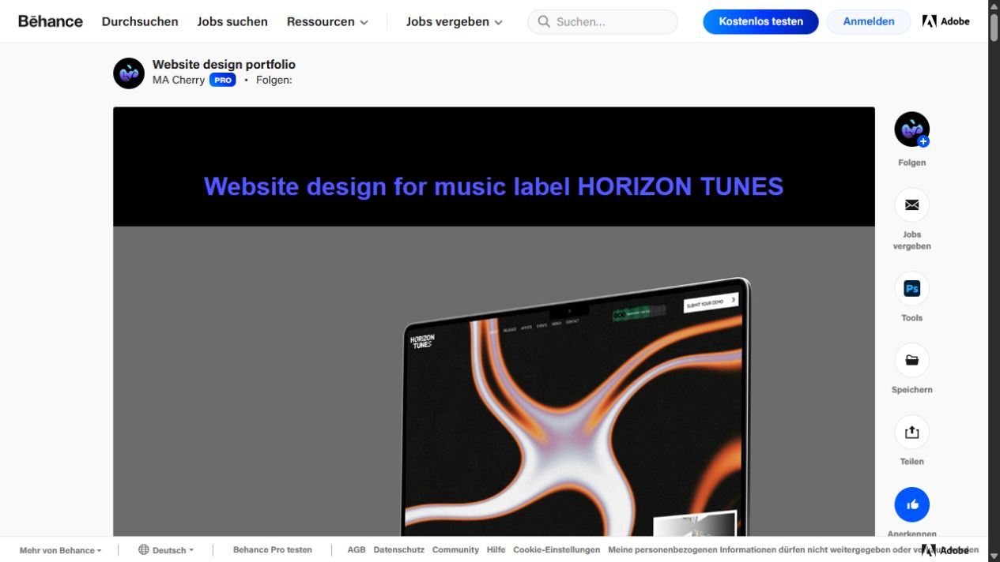
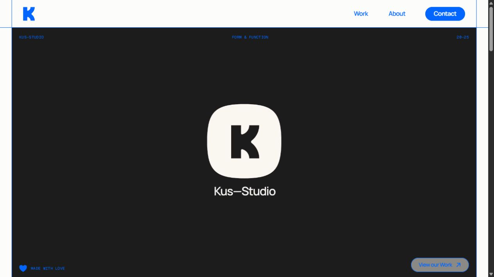
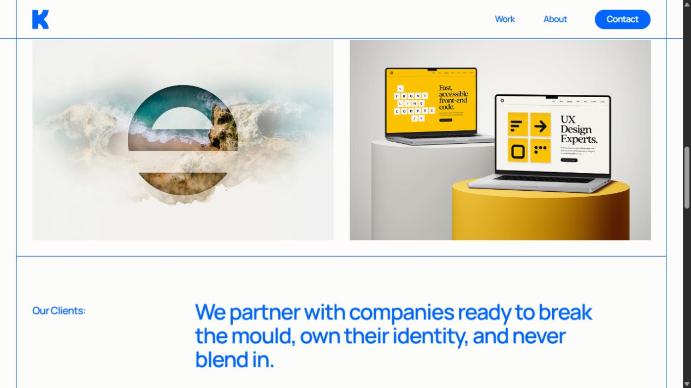
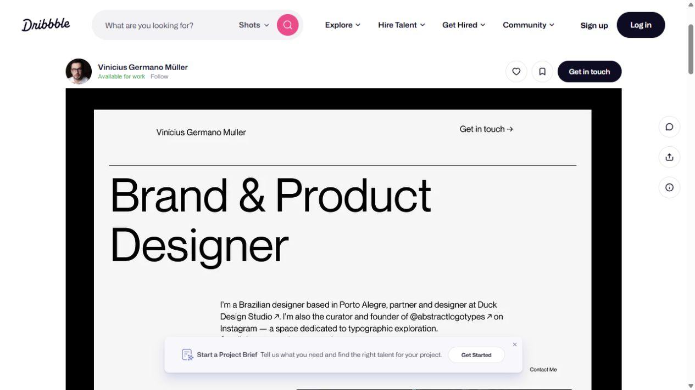
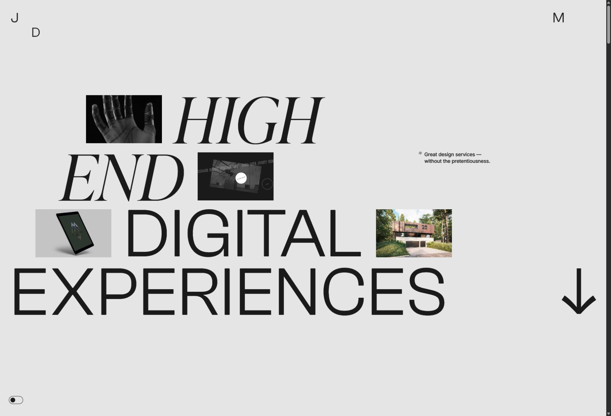
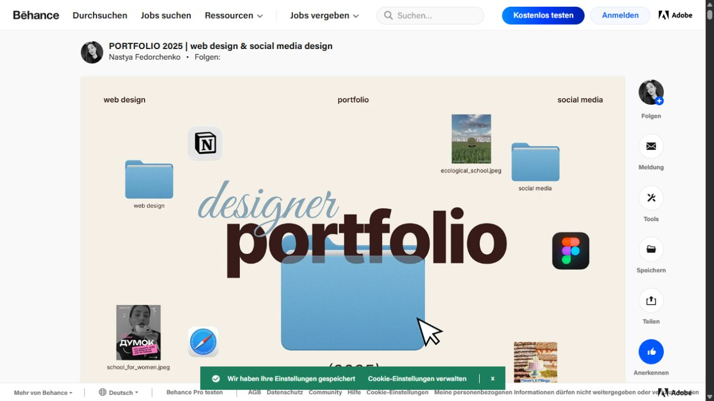
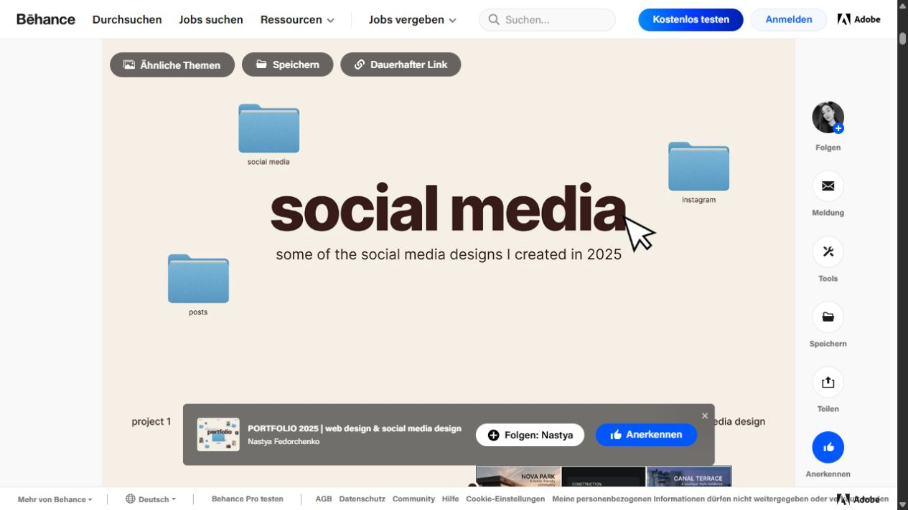
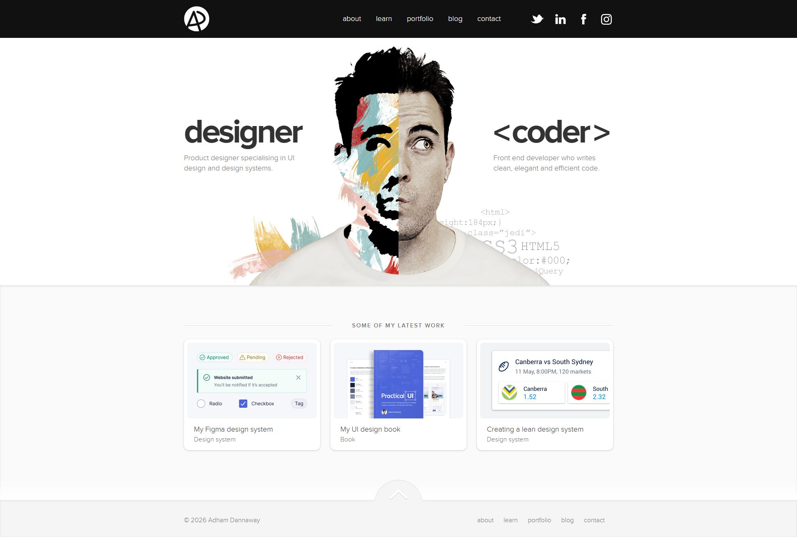
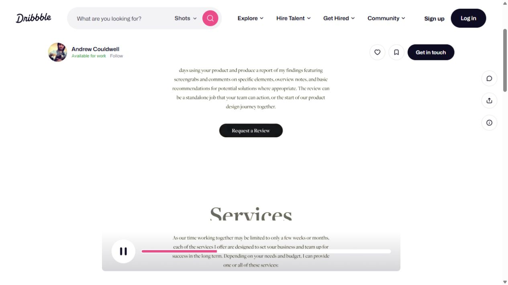

# Portfolio-Referenzen

Recherche: 25. September 2026. Ziel: Kunden für freiberufliches Webdesign, Website-Bilder und ergänzendes Grafikdesign gewinnen.

## Auswahl und Aussagekraft

Sieben kuratierte Referenzen aus Behance, Dribbble und eigenständigen Websites. „Beste“ bedeutet hier: besonders brauchbar für dieses Briefing, kein objektives Weltranking. Bewertet wurden erkennbare Spezialisierung, Qualität der visuellen Präsentation, Hierarchie, Projektzugang und Übertragbarkeit auf einen einzelnen Freelancer.

Alle sieben Detailseiten wurden im Browser geöffnet und visuell betrachtet. Die Screenshots sind lokale Ausschnitte der Recherche, keine vollständigen Website-Archive. Plattformoberflächen und vereinzelt schmale Einblendungen sind enthalten. Bei Andrew Couldwell zeigt die Aufnahme einen Moment des eingebetteten Videos. Mobile Bedienung, Ladeleistung und tatsächliche Kundenanfragen wurden nicht getestet. Empfehlungen sind gestalterische Ableitungen, keine nachgewiesenen Conversion-Ergebnisse.

## 1. MA Cherry – Website design portfolio

- Quelle: https://www.behance.net/gallery/242930095/Website-design-portfolio
- Typ: Behance-Projektsammlung, keine eigenständige Portfolio-Homepage.
- Gesehen: Der Einstieg zeigt ein Webdesign für HORIZON TUNES als große Geräteansicht, schwarze Flächen und ein leuchtendes abstraktes Motiv. Weitere Projekte sind über benannte Abschnitte und Links erschlossen.
- Stärke: Das Medium Website und die gestalterische Arbeit werden unmittelbar sichtbar. Besonders relevant für die Verbindung aus Weblayout und starken Website-Bildern.
- Übertragen: Ein starkes Gesamtbild pro Projekt, danach Layoutdetails und die zugehörige Bildwelt zeigen.
- Nicht übernehmen: Die lange Sammlung und zahlreiche Videoeinbettungen als Aufbau der eigenen Startseite.
- Priorität: Hauptreferenz für Projektinszenierung.

## 2. Kus–Studio / Mike Kus

- Quelle: https://mikekus.com/
- Typ: eigenständige Studio-Website.
- Gesehen: Weißer Rahmen mit blauen Linien und Navigation; dunkler Markenauftakt. Weiter unten stehen farbige Arbeiten im zweispaltigen Raster, unter anderem Bildkomposition und Website-Mockups.
- Stärke: Wiedererkennbare Gestaltung des Rahmens, während die Arbeiten eigene Bildwelten behalten. Work, About und Contact sind klar benannt.
- Übertragen: Wenige Navigationspunkte, großzügige Projektbilder und erkennbare Kontaktaktion. Grafik und Website jeweils im passenden Kontext zeigen.
- Nicht übernehmen: Ein ausgedehnter Markenauftakt würde den Zugang zu deinen Arbeiten verzögern. Die breite Studio-Leistungsliste passt nicht automatisch zu deinem Angebot.
- Priorität: Hauptreferenz für Raster und Präsentationssystem.

## 3. Vinicius Germano Müller – Minimal Portfolio Website

- Quelle: https://dribbble.com/shots/26084234-Minimal-Portfolio-Website-Brand-Product-Designer
- Typ: Dribbble-Konzept; der Autor bezeichnet es als frühen Entwurf.
- Gesehen: Heller Hintergrund, große schwarze serifenlose Typografie, feine Trennlinie, wenig Navigation, eingerückter Vorstellungstext; im weiteren Ausschnitt Projektname neben großem Motiv.
- Stärke: Ruhige, deutliche Rangordnung mit viel Raum für Inhalt.
- Übertragen: Typografischer Einstieg, klare Satzspiegel und kurze Texte. Die eigene Spezialisierung groß ausschreiben.
- Nicht übernehmen: Kleine Kontaktbeschriftungen und große leere Strecken für mobile Kundenbesuche.
- Priorität: Hauptreferenz für Typografie und Ruhe.

## 4. Jomor Design

- Quelle: https://www.jomor.design/
- Typ: eigenständige Website einer Designpraxis.
- Gesehen: Übergroße Typografie, Kontrast aus kursiver Serifenschrift und Sans-Serif, kleine wechselnde Bildfenster innerhalb der Komposition, grauer Grund. Im Seiteninhalt vier hervorgehobene Projekte.
- Stärke: Hohe visuelle Eigenständigkeit und einprägsame Art Direction.
- Übertragen: Ein bewusst gesetzter typografischer Akzent und selbstbewusste Größenverhältnisse.
- Nicht übernehmen: Den gesamten stark inszenierten Einstieg, wechselnde Motive oder abstrahierte Navigation. Dein konkretes Angebot soll früher lesbar sein.
- Priorität: Akzentreferenz, kein Layout zum Kopieren.

## 5. Nastya Fedorchenko – Portfolio 2025

- Quelle: https://www.behance.net/gallery/239103229/PORTFOLIO-2025-web-design-social-media-design
- Typ: Behance-Präsentation für Webdesign und Social-Media-Design.
- Gesehen: Cremefarbener Grund, dunkelbraune große Schrift, hellblaue Ordner, kursiver Schriftakzent und kleine Arbeitsproben. Ein weiterer Ausschnitt trennt Social Media als eigenes Kapitel ab.
- Stärke: Zusammenhängende persönliche Bildsprache und eindeutige Kapitel für unterschiedliche Leistungen.
- Übertragen: Eine eigene visuelle Handschrift und die erkennbare Trennung zwischen Webdesign und Website-Bildern.
- Nicht übernehmen: Betriebssystem- und Tool-Icons als Hauptmotiv. Kunden sollen deine Arbeit sehen, nicht primär deine Werkzeuge.
- Priorität: ergänzende Referenz für Persönlichkeit und Kapitelbildung.

## 6. Adham Dannaway

- Quelle: https://www.adhamdannaway.com/
- Typ: eigenständige Designer-/Entwickler-Website.
- Gesehen: Ein geteiltes Porträt erklärt zwei Rollen, darunter drei aktuelle Arbeiten. Navigation und Kontakt sind textlich benannt.
- Stärke: Die Person und ihre Spezialisierungen werden unmittelbar verständlich.
- Übertragen: Zwei klar erklärte Kompetenzfelder: Website-Design und Website-Bilder. Ein persönliches Porträt im Über-mich-Bereich.
- Nicht übernehmen: Geteiltes Gesicht, Entwicklerpositionierung oder dieselbe Komposition. Die aktuellen Arbeiten sind stark auf Produktdesign und Designsysteme ausgerichtet.
- Priorität: Referenz für verständliche Positionierung.

## 7. Andrew Couldwell – Simple product designer portfolio website

- Quelle: https://dribbble.com/shots/16076355-Simple-product-designer-portfolio-website
- Typ: Dribbble-Präsentation einer Website; Live-Seite nicht separat geprüft.
- Gesehen: Im eingebetteten Video eine ruhige, textbetonte Darstellung, Serifentitel und eine klar benannte Anfrageaktion. Die Beschreibung erläutert ein inhaltsorientiertes One-Page-Konzept.
- Stärke: Leistungen und Kontakt lassen sich in eine kompakte Geschichte integrieren.
- Übertragen: Kurze Startseite mit klaren Abschnitten und verständlicher Anfrage.
- Nicht übernehmen: Textlastige Passagen als Schwerpunkt deiner visuellen Arbeit. Verzögertes Scrollen ist für dein Portfolio nicht vorgesehen.
- Priorität: ergänzende Strukturreferenz.

## Synthese für das eigene Portfolio

| Entscheidung | Grundlage | Eigene Umsetzung |
|---|---|---|
| Arbeiten früh zeigen | MA Cherry, Kus–Studio | Erstes großes Projekt direkt nach kompaktem Einstieg |
| Ruhigen Rahmen nutzen | Müller | Warmes Weiß, dunkle Schrift, wenige Linien |
| Persönlich erkennbar bleiben | Jomor, Fedorchenko | Markante Überschrift und ein sparsamer Serifenkontrast |
| Angebot verständlich machen | Dannaway | Webdesign und Website-Bilder explizit benennen |
| Bilder als eigene Leistung zeigen | MA Cherry, Kus–Studio | Bildmotiv plus Anwendung im Website-Layout |
| Anfrage einfach halten | Kus–Studio, Couldwell | Sichtbarer Kontakt und kurze Projektanfrage |

Empfohlene Richtung: ein helles, redaktionell gestaltetes Portfolio mit großen Arbeitsproben, warmer Grundfarbe und sparsamem kobaltblauen Akzent. Diese konkrete Farbwahl und die folgenden Größenwerte sind ein eigener Designvorschlag, nicht aus Referenzen ausgemessene Werte.

Die gespeicherten Screenshots dienen als interne Referenz. Fremde Projekte, Texte, Logos und Bilder werden nicht als eigene Arbeitsproben in die Homepage übernommen.

Nächste Arbeitsgrundlage: [DESIGN.md](../DESIGN.md).
